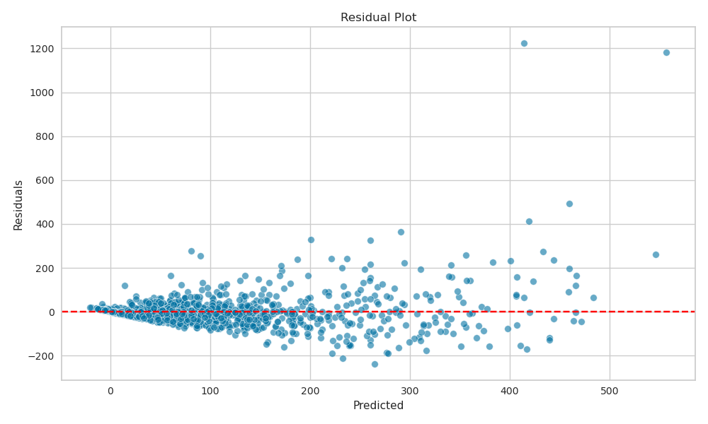

# Predicting Municipal Service Request Volumes Using Spatial Features

---

## Overview

This project aims to predict the number of municipal service requests in different geographic areas using features such as infrastructure density, spatial clustering, and service type trends.

---

## Table of Contents

- [Overview](#overview)
- [Problem Statement](#problem-statement)
- [Data Description](#data-description)
- [Project Structure](#project-structure)
- [Methodology](#methodology)
- [Results](#results)
- [Usage](#usage)
- [Model Improvement Steps](#model-improvement-steps)
- [Limitations & Future Work](#limitations--future-work)
- [Contributors](#contributors)
- [License](#license)
- [Acknowledgements](#acknowledgements)

---

## Problem Statement

The City of Cape Town receives thousands of service requests daily across various departments, ranging from waste collection to street maintenance. Efficient resource allocation requires the ability to anticipate request volumes at a fine geographic level.

The objective of this project is to build a predictive model that estimates the number of service requests of type **'Sewer: Blocked/Overflow'** within each H3 hexagonal grid cell (resolution level 8). By leveraging geospatial features (e.g., proximity to infrastructure and request density), the model helps identify high-demand zones before requests are even submitted.

This enables city planners and operational teams to:

- Proactively allocate staff and equipment  
- Identify under-served areas  
- Investigate anomalies in request volumes  

Ultimately, this supports a smarter, more responsive urban service delivery system.

---

## Data Description

- Data supplied by the **City of Cape Town**
- Features include: `code` (service request type), `latitude`, `longitude`, and `h3_level8_index`
- Records with `h3_level8_index = 0` were removed
- Dataset enriched with features from **OpenStreetMap** (e.g., schools, hospitals, religious sites)

---

## Project Structure

```
├── data/               # Raw and processed datasets
├── notebooks/          # EDA and modeling notebooks
├── src/                # Custom scripts and utilities
├── models/             # Saved model files
├── outputs/            # Visualizations, reports
├── requirements.txt    # Python dependencies
├── README.md
```

---

## Methodology

### Exploratory Data Analysis (EDA)

- Many features contained missing values
- Missing `h3_level8_index` values (set to 0) were dropped
- 22.5% of records had missing latitude/longitude
- 86% of `cause_code` and `cause_code_group` were missing
- `code` and `code_group` were fully populated

### Feature Engineering

- Added infrastructure features using OpenStreetMap data
- Assigned infrastructure to H3 hexagonal cells using the `h3` library
- Created density indicators (e.g., number of clinics, schools, shops)

### Modeling

- **Baseline model**: `RandomForestRegressor`
- **Improved model**: `LGBMRegressor`
- **Tuning**: Hyperparameter optimization with **Optuna**

### Evaluation

- Metrics: **Root Mean Squared Error (RMSE)** and **R²**

---

## Results

### 1. Baseline Model

This initial model used only `latitude`, `longitude`, and default hyperparameters.

**Metrics:**
- RMSE: 114.6
- R²: 0.31

  


---

### 2. Improved Model

This model included spatial and infrastructure features derived from OpenStreetMap (e.g., clinics, schools).

**Metrics:**
- RMSE: 105.9
- R²: 0.41

  
### Actual vs. Predicted Plot Interpretation

This scatter plot compares actual request counts (x-axis) to predicted values (y-axis). The red dashed line represents **perfect prediction** (i.e., where `actual = predicted`).

---

#### What’s Working Well
- The majority of predictions fall close to the **perfect prediction line**, especially for low to moderate request volumes.
- This indicates the model captures general trends well across most hexagons.

---

#### Issues Observed

1. **Underprediction at High Volumes**
   - As actual values increase, the model tends to **underpredict** (points fall below the red line).
   - Suggests the model is **less confident in high-demand areas**.
   - These may be due to:
     - Missing explanatory features (e.g., event data, population density)
     - Few training samples in these ranges (data imbalance)

2. **High-Density Cluster at Low Values**
   - Most points are **clustered in the lower left corner**, indicating that most H3 hexes have relatively few requests.
   - This class imbalance can bias the model toward underpredicting high-volume zones.

---

#### Key Takeaway

The model performs reasonably well at predicting common, low-to-moderate request volumes but tends to **underestimate outlier zones** with very high activity. To improve:

- Add domain features (population, socioeconomic data, etc.)
- Apply log transformation to stabilize variance
- Use custom loss functions that penalize high-magnitude errors

  

### Residual Plot Interpretation

This residual plot shows **residuals vs. predicted values** for the regression model.

---

#### What’s Working Well
- Most residuals are **centered around zero**, which indicates that the model generally captures the trend in the data.
- There is **no strong curvature or systematic bias**, suggesting decent model fit.

---

#### Issues Observed

1. **Heteroscedasticity (Non-constant Variance)**  
   - Residuals become **more spread out** at higher predicted values.
   - This "fanning out" pattern suggests that **prediction error increases** as request volume increases.
   - **Implication**: The model has higher uncertainty in high-volume hexes.

   **Mitigation strategies:**
   - Apply a **log or Box-Cox transformation** to the target variable.
   - Use **quantile regression** or a **weighted loss function**.
   - Investigate whether certain features are more predictive in high-volume areas.

2. **Presence of Outliers**
   - A few residuals exceed 800+, indicating **large errors**.
   - These may correspond to:
     - Data quality issues (e.g., miscoded request volumes)
     - Hexes with **unusual activity** (e.g., events, infrastructure issues)
     - Missing explanatory features (e.g., socio-economic data, population)

---

#### Key Takeaway

While the model performs well for the majority of predictions, it **struggles with high-volume request zones**. Improving the feature set, transforming the target, or handling outliers could further improve performance.


---

### 3. Optimized Model (After Hyperparameter Tuning)

After tuning the LightGBM model using Optuna, performance improved modestly.

**Metrics:**
- RMSE: 101.6
- R²: 0.44

 

---

### Actual vs. Predicted — Optimized Model

This scatter plot compares actual request counts (x-axis) to model predictions (y-axis) for the optimized LightGBM model.

The red dashed line represents perfect prediction (`actual = predicted`).

---

#### Improvements Observed
- Predictions for the **majority of samples (low-to-moderate values)** are tightly clustered near the red line, showing improved accuracy in the model's core range.
- Compared to earlier models, the spread of predictions is **narrower**, indicating better learning of request patterns.
- Outlier handling is slightly improved, but still not ideal.

---

#### Remaining Issues
- **Underprediction of high values** remains:
  - The model continues to **undervalue extreme actual counts** (visible as points far below the red line).
  - A hexagon with ~1750 actual requests is predicted at < 500 — a substantial underestimation.
- This suggests the model still lacks sensitivity to rare high-request hexagons.

---

#### Key Takeaways
- The optimized model has learned the general distribution more effectively than the baseline or improved versions.
- Performance **improves across common zones**, but the model **struggles to extrapolate** when facing outlier hexes.
- Further improvements may require:
  - Better sampling or weighting strategies for rare high-volume zones.
  - Including additional explanatory features (e.g., event frequency, socio-economic conditions).
  - Applying a log transformation or quantile-based regression.


  

---

### Residual Plot — Optimized Model

This plot shows the residuals (actual − predicted) on the y-axis against predicted values on the x-axis. The red dashed line represents perfect predictions (residual = 0).

---

#### Improvements Observed
- Residuals for most mid-range predictions are tightly clustered around zero, suggesting the model generalizes well across common cases.
- The overall spread of residuals is more balanced compared to earlier versions, indicating reduced bias.

---

#### Remaining Issues
- **Outliers remain problematic**:
  - A few points show **residuals > 1000**, meaning the model underestimates demand in high-volume hexes.
- Slight **funnel shape** in residuals:
  - Suggests **heteroscedasticity** — the variance of residuals increases as predictions increase.
  - This is common in count data with extreme values and may benefit from target transformation (e.g., log or Box-Cox).

  ---

#### Key Takeaways
- The optimized model performs consistently for the majority of the prediction range.
- It still struggles with **rare, high-request hexes**, which may require:
  - Sampling or upweighting techniques
  - Specialized models for tail distributions
  - Incorporation of additional contextual features (e.g., events, population density)


---

## Key Insights or Takeaways

- Request volumes are correlated with infrastructure density, particularly clinics and schools
- Hyperparameter tuning reduced RMSE by ~11%
- Two hexagons had consistently high residuals; these may be outliers or missing important contextual drivers
- Feature importance confirmed top predictors: dominant service type, latitude, longitude, and infrastructure counts

---

### 4. Prediction on All Data

 

  


# Feature Importance Analysis

This feature importance plot highlights which variables most influenced the model’s predictions when trained on the full dataset.

---

## Top Predictive Features

### 1. `dominant_type_count`
- The most important feature.
- Suggests that areas with a highly dominant service request type tend to have more predictable or higher request volumes.
- Indicates systemic issues in those regions (e.g., repeated infrastructure failures).

### 2. `longitude` and `latitude`
- Strong geospatial predictors.
- Implies that **location-specific patterns** (e.g., regional disparities, infrastructure quality, or socio-economic variation) are major drivers.
- Spatial clustering or adding geo-lag features may further improve prediction.

### 3. `num_unique_request_types`
- Diversity of service requests in an area is a key indicator of service demand complexity or population behavior.
- High diversity may correlate with high volume or instability.

---

## Mid-Level Predictors

- `num_schools`
- `num_traffic_signals`
- `dominant_request_type_No Power`

These features relate to **infrastructure** or **frequent utility issues**, acting as indirect indicators of urban density or public service strain.

---

## Lower Importance Features

- `num_shops`, `num_religious_sites`, `dominant_request_type_No Water WMD`, `num_bus_stops`, `dominant_request_type_Empty Septic Tank`, `num_clinics`
- These features contributed less to the model.
- Some `dominant_request_type_*` features may be sparse or too specific to generalize across regions.
- `num_clinics` and `num_bus_stops` likely add noise rather than predictive power.

---

## Key Insights

- **Spatial patterns and request type concentration** are the strongest drivers of service request volume.
- **Basic infrastructure presence** (e.g., schools, traffic signals) still holds explanatory power.
- Some features have **minimal impact** and can potentially be dropped or aggregated for a cleaner model.

---

## Recommendations

- **Leverage spatial clustering** or add region-level encoded variables.
- **Engineer compound features** (e.g., service_density, infrastructure_index).
- **Drop low-importance features** or use feature selection to reduce noise.
- Experiment with **non-linear models** or **spatial regression** to capture interaction effects.

---

### Spatial Prediction Comparison

The following maps compare actual and predicted service request counts across the city using hexagonal bins (H3 resolution 8):

- **Left**: Actual request count  
- **Middle**: Model-predicted request count  
- **Right**: Residuals (Actual - Predicted), where red indicates underprediction

This visualization highlights spatial patterns in both performance and error distribution, helping to diagnose over/under-serving areas and improve future models.


## Usage

To run the project locally:

### 1. Open and run the following notebooks:

- `00_data_transformation.ipynb`
- `01_eda.ipynb`
- `02_feature_engineering_and_modeling.ipynb`

### 2. Setup

```bash
# Clone the repository
git clone https://github.com/your-username/project-name.git
cd project-name

# Create and activate a virtual environment
conda create -n geo_model_env python=3.10
conda activate geo_model_env

# Install dependencies
pip install -r requirements.txt
```
## Notes & Deviations

This project avoids using the `h3` Python library due to known installation and build issues on some systems. Instead, we assign `h3_level8_index` values using a geospatial join approach with `GeoPandas` and the provided `city-hex-polygons-8.geojson` file.

As a result, a small number of service requests may be assigned to slightly different hex indices compared to the provided `df_sr_hex.csv.gz` reference file. This is expected and results from minimal differences in polygon boundary interpretation and centroid placement.

These discrepancies (e.g., fewer than 10 rows out of hundreds of thousands) do not meaningfully impact modeling accuracy or validation outcomes.

---

## Model Improvement Steps

### 1. Target Transformation  
Apply log or Box-Cox transformation to reduce skewness and stabilize variance.

### 2. Feature Engineering  
Create meaningful interaction terms and encode domain knowledge, such as:
- Density features (e.g., requests per clinic or per bus stop)
- Interaction ratios (e.g., clinics × hospitals)
- Proximity counts or clustering labels

### 3. Try Other Models (Stacking or Ensembles)  
Test alternative models like **CatBoost**, **RandomForest**, or **XGBoost**.

Also try:
- `VotingRegressor` for model averaging  
- `StackingRegressor` for meta-modeling

### 4. Outlier Removal  
Remove the top 1% of request volumes per hex to reduce noise and model instability.

### 5. Spatial Smoothing  
Add spatial lag features that incorporate neighboring activity:

```python
# Example: Add average target from neighboring hexes
avg_requests_nearby = df.groupby('h3_index').apply(
    lambda row: avg_requests_in_neighbours(row['h3_index'])
)
```

---

## Limitations & Future Work

- Additional external data (e.g., population, weather, socioeconomic indicators) could further improve performance
- Current models assume spatial stationarity; future work could include dynamic or temporal modeling

---

## Contributors

- Anne-Marie Killer

---

## License

This project is licensed under the **MIT License**. See the `LICENSE` file for details.

---

## Acknowledgements

- City of Cape Town for supplying the dataset  
- This project used **ChatGPT by OpenAI** for development assistance  
- Tools used: `Python`, `scikit-learn`, `pandas`, `shap`, `optuna`, `osmnx`, `LightGBM`